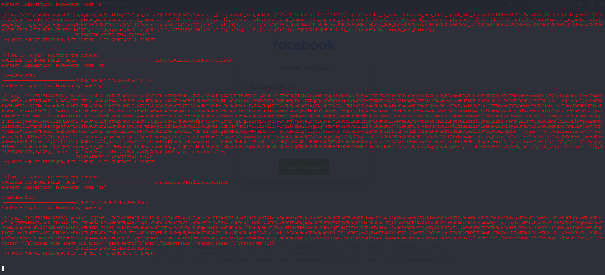
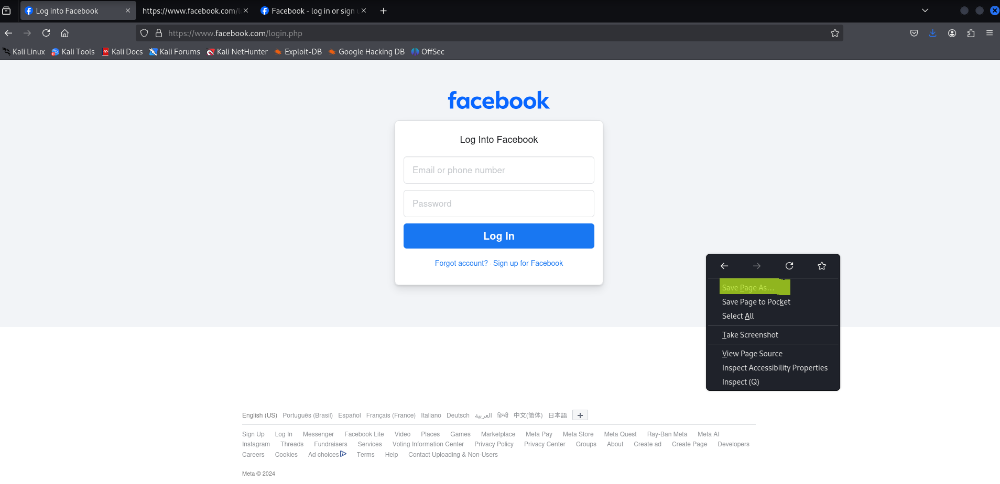
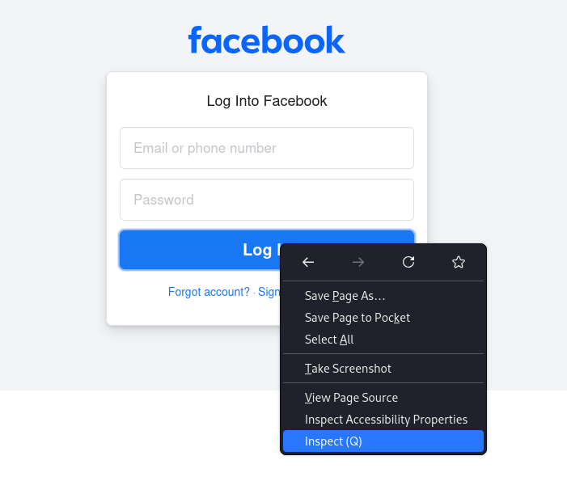
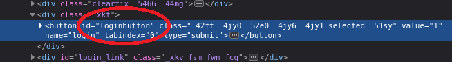
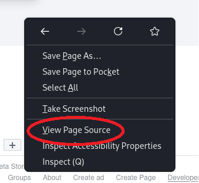
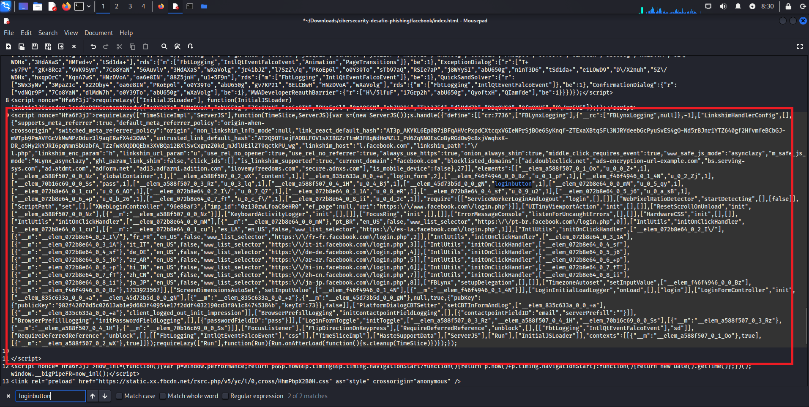
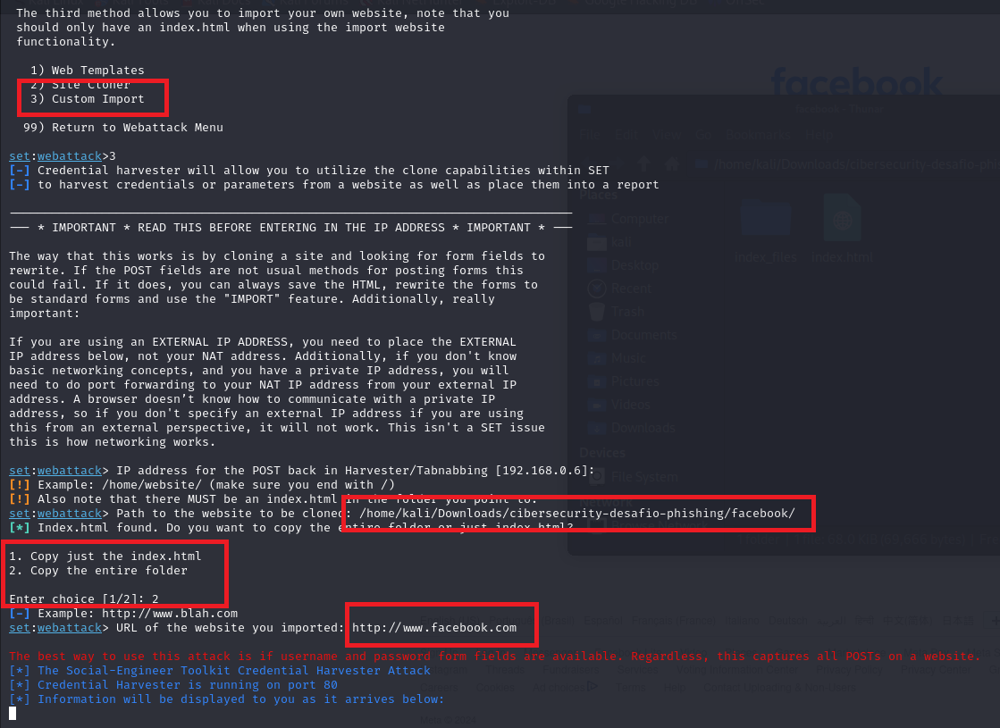
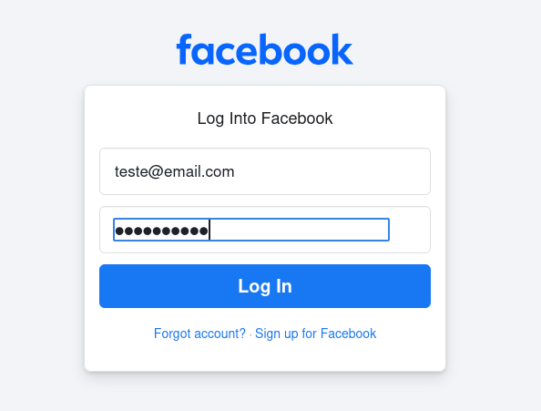
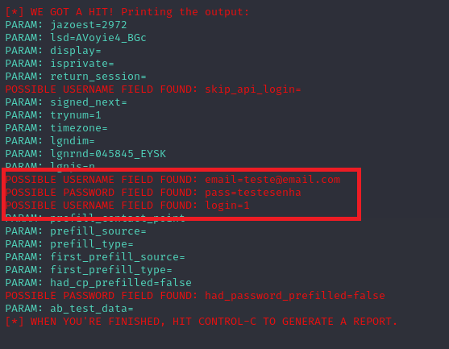

# Phishing com página de login falsa com SEToolKit

## Ferramentas necessárias 🔨

- Kali
- SEToolKit
- Conexão de rede da VM em modo Bridge

## Comandos 💻

### Configurando o Phishing no Kali Linux

- Acesso root: ``` sudo su ```
- Iniciando o setoolkit: ``` setoolkit ```
- Tipo de ataque: ``` Social-Engineering Attacks ```
- Vetor de ataque: ``` Web Site Attack Vectors ```
- Método de ataque: ```Credential Harvester Attack Method ```
- Método de ataque: ``` Site Cloner ```
- Obtendo o endereço da máquina: ``` ifconfig ```
- URL para clone: http://www.facebook.com

Atualmente, o facebook conta com defesa contra scripts maliciosos, então nossos resultados não são os desejados.



Para resolver este problema, entraremos no site original do facebook e salvaremos salvaremos a pagina (guarde o caminho salvo) e alteraremos a funcionalidade do botão login.



Após isso, vamos analisar o botão de login, responsável por chamar o script que criptografa os dados enviados.



Ao inspecionar, podemos ver que o nome do botão é ```loginbutton```



Agora vamos visualizar o source-code da pagina inicial do facebook e copiá-lo para o index.html 



Dentro do arquivo index.html, buscaremos o nome ```loginbutton``` e apagaremos o script onde é chamado



Após salvar, está pronto o clone. 

### Utilizando o site customizado

Em vez de utilizarmos o comando para clonar, utilizaremos o custom import e apontaremos para a pasta onde está salvo nosso site



### Testando o site clonado

Agora, no navegador, entraremos no site utilizando o ```IP``` ou ```localhost```, caso esteja rodando o Kali pela VM e não consiga conectar no site pelo computador principal, a porta pode estar fechada, execute ```sudo ufw allow 80``` e a porta 80 será liberada.

Tudo pronto, em seguida, o teste e o retorno no aplicativo.


